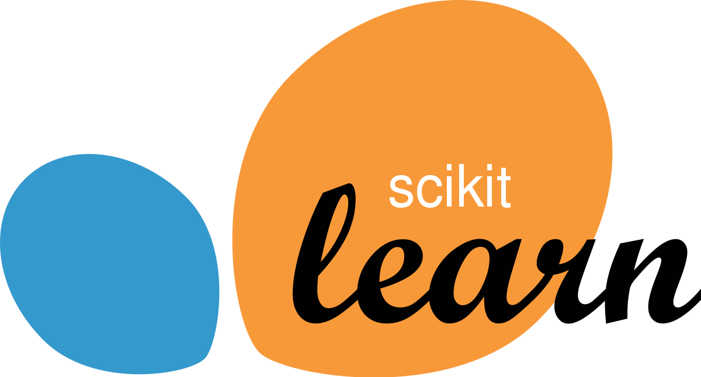

# Introduction to Scikit-Learn

  
 

Scikit-learn é uma biblioteca de aprendizado de máquina em Python que fornece uma ampla gama de algoritmos e ferramentas para análise de dados e modelagem preditiva. Ele é construído sobre outras bibliotecas populares, como NumPy, SciPy e Matplotlib, e é amplamente utilizado na comunidade de ciência de dados.

O scikit-learn oferece suporte a várias tarefas de aprendizado de máquina, incluindo classificação, regressão, clustering e redução de dimensionalidade. Ele fornece implementações eficientes de muitos algoritmos populares, como árvores de decisão, SVM (Máquinas de Vetores de Suporte), kNN (k-Vizinhos Mais Próximos), regressão linear, entre outros.

A biblioteca também possui ferramentas para pré-processamento de dados, como normalização, codificação de variáveis categóricas e seleção de características. Além disso, oferece recursos para avaliação de modelos, validação cruzada, seleção de hiperparâmetros e pipelines de fluxo de trabalho.

O scikit-learn é amplamente utilizado em projetos de aprendizado de máquina e análise de dados devido à sua facilidade de uso, documentação abrangente e comunidade ativa de desenvolvedores. Ele fornece uma interface consistente e intuitiva para a construção, ajuste e avaliação de modelos de aprendizado de máquina, permitindo que os usuários experimentem diferentes algoritmos e técnicas com facilidade.

Em resumo, o scikit-learn é uma biblioteca de aprendizado de máquina em Python que oferece uma ampla gama de algoritmos e ferramentas para análise de dados e modelagem preditiva, facilitando o desenvolvimento de modelos de aprendizado de máquina eficientes.

## Atividade realizada

Treinamento de modelo de regressão linear simples para prever, sem causalidade, a relação entre horas de estudos por mês, e salário recebido.
